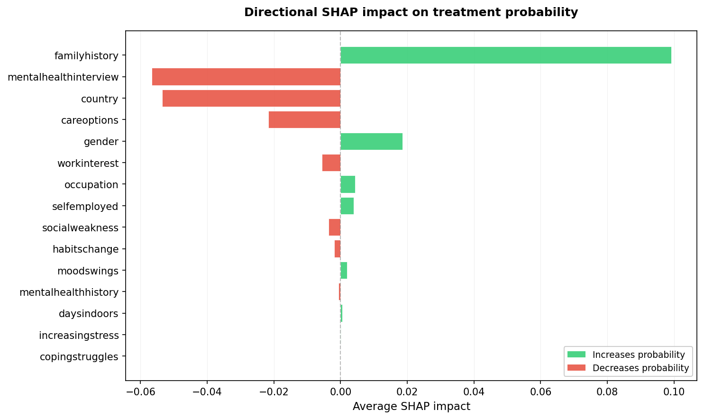

# Evaluation Results

- Timestamp: 20251104_143733 (généré via `python -m src.main_global pipeline`)

Les artefacts associés (JSON, métriques détaillées, logs) sont disponibles dans `results/run_20251104_143733/`.

## Ridge Baseline

Modèle de référence avec régression logistique Ridge (optimisation du paramètre C via cross-validation).

- C optimal: 0.0162
- Logloss: 0.5777
- AUC: 0.7675
- Accuracy: 0.6971
- F1: 0.6930
- Recall: 0.6959

## Global Metrics

## Global Metrics

- Logloss: 0.4767
- AUC: 0.8380
- Accuracy: 0.7515
- F1: 0.7613
- Recall: 0.8065

## Fairness by Gender

- Overall AUC: 0.8380
- AUC gap: 0.0546
  - female: AUC=0.8797 | logloss=0.3688 | n=6234
  - male: AUC=0.8250 | logloss=0.4913 | n=46032

## Fairness by Country

- Overall AUC: 0.8380
- AUC gap: 0.0992
  - canada: AUC=0.8978 | logloss=0.3740 | n=2815
  - others: AUC=0.8788 | logloss=0.3851 | n=8979
  - uk: AUC=0.8496 | logloss=0.4377 | n=9522
  - usa: AUC=0.7986 | logloss=0.5247 | n=30950

## SHAP

## SHAP vs Cramér's V

| Feature | Mean SHAP | Cramér's V |
| --- | ---: | ---: |
| familyhistory | 0.0845 | 0.3636 |
| mentalhealthinterview | -0.0470 | 0.0905 |
| careoptions | -0.0310 | 0.2967 |
| country | -0.0273 | 0.1244 |
| gender | 0.0203 | 0.1467 |
| selfemployed | -0.0144 | 0.0370 |
| mentalhealthhistory | 0.0058 | 0.0104 |
| workinterest | -0.0032 | 0.0045 |
| habitschange | 0.0024 | 0.0035 |
| socialweakness | 0.0022 | 0.0032 |
| increasingstress | -0.0014 | 0.0100 |
| daysindoors | 0.0010 | 0.0078 |
| occupation | -0.0004 | 0.0102 |
| moodswings | -0.0004 | 0.0048 |
| copingstruggles | -0.0000 | 0.0071 |

## Best Hyperparameters (CatBoost)

Source: `results/optimization/best_params.json`

- depth: 10
- learning_rate: 0.003921243855637543
- l2_leaf_reg: 0.0053024228766843555
- bagging_temperature: 0.489452760277563
- iterations: 1935
